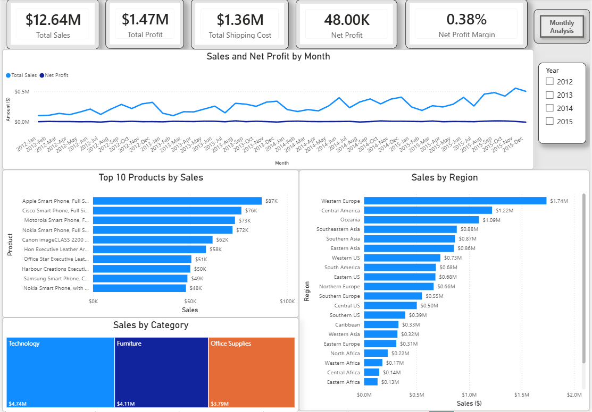
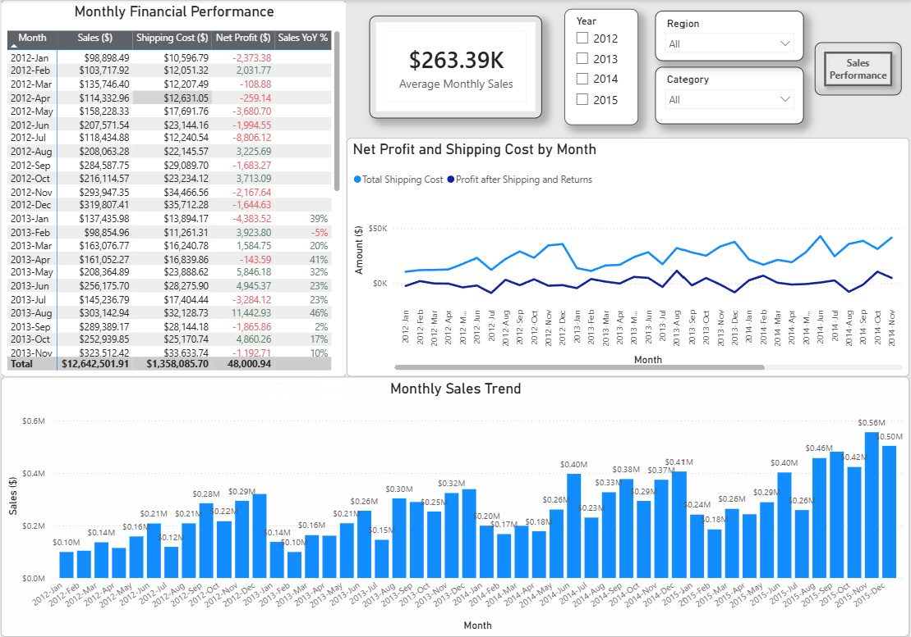
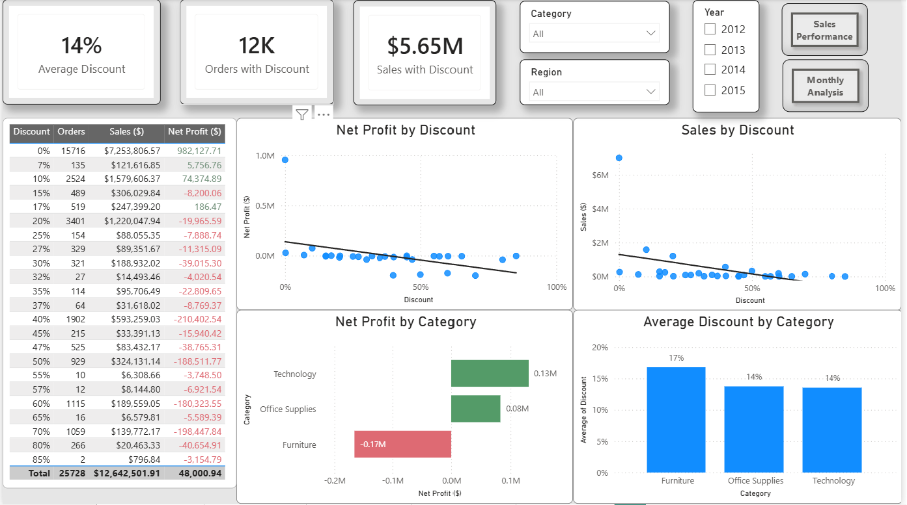
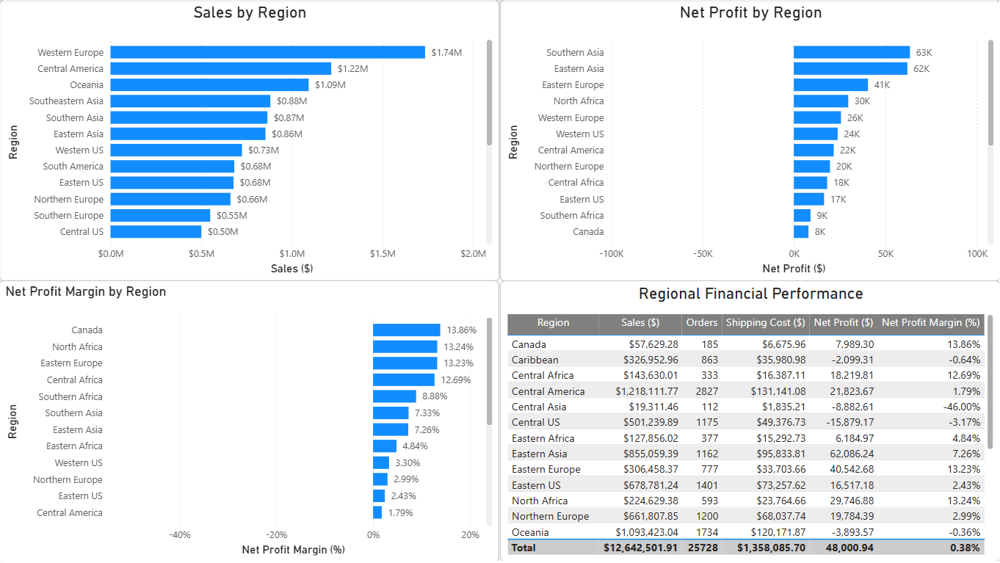
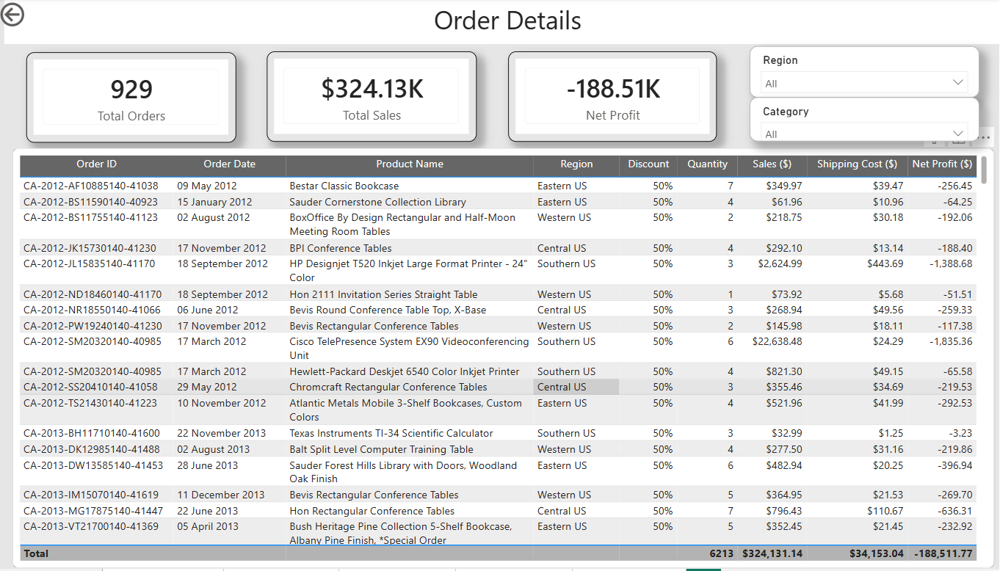

# Power BI Sales & Profit Analysis

## Project Overview
This Power BI project analyzes sales performance, profitability, discounts, regional performance, and order-level data. The report provides an interactive view of key business metrics and helps identify trends affecting sales and net profit.

## Tools
- Power BI
- Power Query
- DAX

## Key Metrics
- Total Sales: $12.64M
- Total Profit: $1.47M
- Total Shipping Cost: $1.36M
- Net Profit: $48K
- Net Profit Margin: 0.38%
- Average Discount: 14%

## Analysis
- Analyzed sales and net profit performance over time
- Identified Top 10 products by sales
- Compared sales across product categories
- Analyzed monthly sales and financial performance
- Evaluated the relationship between discounts, sales, and net profit
- Compared net profit across product categories
- Analyzed sales and profitability by region
- Created detailed order-level analysis with sales, shipping costs, discounts, and net profit

## Dashboard Pages

### Sales Performance

### Monthly Analysis

### Discount Analysis

### Regional Analysis

### Order Details

## Project File
`PowerBI_Sales_Profit_Analysis.pbix`
